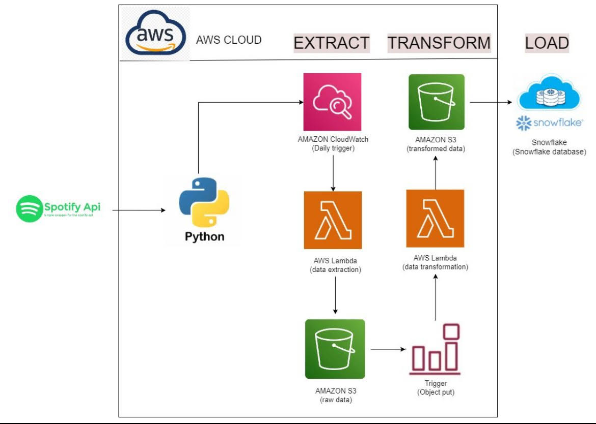

# Spotify_ETL_Pipeline

Implementing a Complete Data Pipeline as a Data Engineering Project using Spotify

Various steps listed below that we need to follow to create this ETL pipeline.

1. Integrating with Spotify API and extracting Data
2. Deploying code on AWS Lambda for Data Extraction
3. Adding trigger to run the extraction automatically
4. Writing transformation function
5. Building automated trigger on transformation function
6. Store files on S3 properly
7. Building Analytics Tables on data files using Glue and Athena

